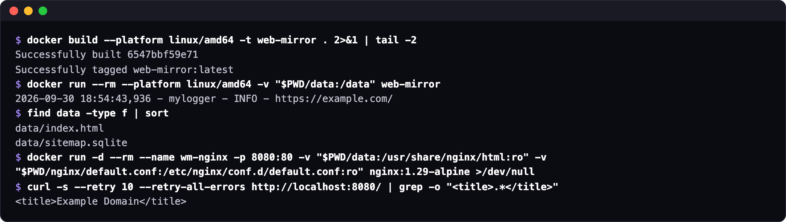

# Getting started

## What you need

- Docker.
- About 2 GB of disk for the image.
- An amd64 machine, or an Apple Silicon Mac whose Docker emulates amd64 with Rosetta, with `--platform linux/amd64` on every `docker build` and `docker run` below. The image's base, `selenium/standalone-edge:153.0`, has no arm64 build. Under QEMU emulation the image builds but Chromium crashes at launch, so on Colima start the VM with `--vm-type vz --vz-rosetta`, and in Docker Desktop turn on "Use Rosetta for x86_64/amd64 emulation on Apple Silicon" ([Troubleshooting](troubleshooting.md#chromium-crashes-at-launch-on-an-apple-silicon-mac)).
- A project folder Docker can mount. On a Mac, Docker runs in a VM that sees only the folders it shares; Colima shares your home folder by default.
- The address of the site you want to copy, and the pages you want.

## Point it at your site

```bash
git clone https://github.com/GeiserX/web-mirror.git && cd web-mirror
```

Open `src/main2.py` and replace `www.place.holder` with your site's host on lines 27, 71 and 72, then put the pages you want on line 34. For the front page of `example.com` the four lines read:

```python
    web = "https://example.com/"                                        # line 27
    return ["https://example.com/"]                                     # line 34
            if tag[attribute_name].startswith("https://example.com/"):  # line 71
                tag[attribute_name] = tag[attribute_name].replace("https://example.com", "")  # line 72
```

[Configuration](configuration.md) explains each line, and how to save every page of the site's sitemap instead of a list.

## Build and run

```bash
docker build -t web-mirror .
docker run --rm -v "$PWD/data:/data" web-mirror
```

On an Apple Silicon Mac, `docker build --platform linux/amd64 -t web-mirror .` and `docker run --rm --platform linux/amd64 -v "$PWD/data:/data" web-mirror`. Without the flag the build stops at its first step ([Troubleshooting](troubleshooting.md#the-build-stops-at-the-first-step-on-an-apple-silicon-mac)). The build downloads about 2 GB and took under 5 minutes under Rosetta on an M-series Mac mini; the run of one page took a few seconds.

## What "it worked" looks like

```text
$ docker run --rm --platform linux/amd64 -v "$PWD/data:/data" web-mirror
2026-09-30 18:54:43,936 - mylogger - INFO - https://example.com/
$ find data -type f | sort
data/index.html
data/sitemap.sqlite
```

The run logs one line per page and exits. The copy is in `./data`: `index.html` is the saved page, `sitemap.sqlite` the cache of the sitemap request. [Usage](usage.md#where-each-page-lands) shows where other pages land.



## Serve it

```bash
docker run --rm -p 8080:80 \
  -v "$PWD/data:/usr/share/nginx/html:ro" \
  -v "$PWD/nginx/default.conf:/etc/nginx/conf.d/default.conf:ro" \
  nginx:1.29-alpine
```

Open <http://localhost:8080>. Next: [Usage](usage.md) for running it again and using the published image without a build, [How it works](how-it-works.md) for what the copy contains.
