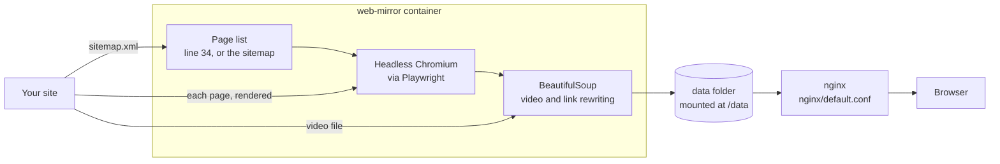

# How it works

web-mirror is one Python script, [`src/main2.py`](https://github.com/GeiserX/web-mirror/blob/main/src/main2.py), about 90 lines. The Docker image runs it once and exits.

## One run, step by step

1. Creates `/data/` and installs a `requests` cache at `/data/sitemap.sqlite`.
2. Fetches `https://<site>/es/sitemap.xml` and collects its `<loc>` entries. The shipped code then returns the fixed list on line 34 instead ([Configuration](configuration.md#using-the-sitemap)).
3. Starts headless Chromium with a fixed `User-Agent` and, for each page in the list:
    1. opens it in a new tab and waits for the `load` event, then 3 more seconds;
    2. takes the page as the browser now holds it (`page.content()`), so text that JavaScript added is in the saved file;
    3. if the page has a `<video>`, downloads the file its `src` names into a folder named after the page, and saves the page as `<path>.html` instead of `<path>/index.html`;
    4. rewrites every `href` on `<a>`, `<link>` and `<base>` that starts with the site's address to a path from the root (`https://example.com/about/` becomes `/about/`);
    5. writes the result under `/data/`, in a folder named after the URL path.
4. Closes the browser.

## What is saved and what is not

- Saved: the HTML of each page in the list, as rendered, and the file of a `<video src>` on it.
- Not saved: stylesheets, scripts, images, fonts, or `<source>` elements inside a video. A `<link>` stylesheet on the site is rewritten to a local path the copy does not contain, and an image keeps its live URL, so offline the page shows its text without its styles or pictures.
- Not followed: links. Only the pages in the list (or the sitemap) are saved; nothing is discovered by crawling.
- Not rewritten: `src` attributes, links written as `http://` when the site is `https://`, links to the site without `www.` when line 27 has it (or the reverse), and links that were already relative.

## The other scripts in `src/`

The image runs `main2.py` only. The other three are earlier versions kept in the repo and covered by the tests:

| File | What it does |
|---|---|
| `main.py` | the same flow with Selenium and Microsoft Edge instead of Playwright, writing under `/data/es` |
| `old_main.py` | a recursive crawl with undetected-chromedriver, following links that start with `/es` |
| `old_video.py` | saves one video page and its video to the working folder |

The image is built on `selenium/standalone-edge:153.0`, which brings Edge and Selenium for `main.py`, and adds every Playwright browser with `playwright install`; that is why it is about 1.9 GB and why it exists for amd64 only.

## What talks to what

- The container talks to the site you set, and to nothing else: the sitemap and the video downloads through `requests`, the pages through Chromium, which also loads whatever the page itself loads (scripts, images, analytics) while it renders.
- nginx serves the saved files from your disk and makes no outside request. A saved page still points at the live site for its images and scripts, so a browser that is online loads those from the site when you open the copy.
